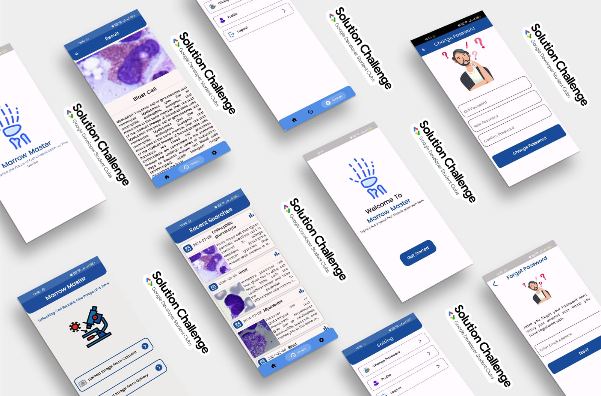

 

    

        
    

    

            <h3><b>Marrow Master</b></h3>
            
<i>Experience the future of cell classification on your device</i>

    
      

 
<h1 align="center">Marrow Master</h1>

**Marrow Master: Experience the future of cell classification on your device**

Marrow Master revolutionizes bone marrow cell classification using machine learning. With a diverse dataset, our model offers quick and accurate analysis accessible via a user-friendly Flutter mobile app.

## Problem Statement

 
<blockquote align='center'>
<h3>“6 out of 10 people suffer from blood cancer.”</h3>
</blockquote>
 

With the rising prevalence of blood cancer among ageing populations, patients face debilitating symptoms like fatigue and weakness, leading to frequent hospital visits and emotional distress. This creates significant challenges for both patients and caregivers, emphasizing the urgent need for improved management strategies.

## 🎥 &nbsp;Demo Video

> Video Link: https://youtu.be/bIR2xIDkA4A?si=JWXr_U4hXUA6FASp

## 🛠️ &nbsp;Key Functionalities

### Clinical Diagnostics Assistance:
This application focuses on aiding haematologists and pathologists in accurately classifying bone marrow cells to diagnose and monitor various blood diseases, including leukaemia, anaemia, myelodysplastic syndromes, and others. Leukaemia is a cancer of the blood or bone marrow characterized by an abnormal increase in white blood cells. Anaemia is when the body lacks enough healthy red blood cells to carry adequate oxygen to the body's tissues. Myelodysplastic syndromes are a group of disorders caused by poorly formed blood cells or a malfunction in the bone marrow.

### Research Support:
In addition to clinical use, this application supports research in haematology, stem cell biology, and related fields. Researchers can utilize it to study bone marrow samples for scientific investigations, medication development, and a deeper understanding of hematopoiesis—the process of blood cell formation. Accurate classification of bone marrow cells is crucial for guiding treatment decisions and monitoring patient development.

### Educational Tool:
This application serves as an educational tool for training new haematologists and pathologists. It provides expertise in bone marrow cell classification and helps users comprehend the complexities of different cell types. This feature contributes to the professional development of medical practitioners in the field.

### User Authentication and Profile Management:
Users can register and log in to the system, accessing a personalized home screen upon login. They have the option to upload images from the gallery or camera, which are then sent to the server's model for analysis. Results, including cell name and description, are returned to the user's app and stored in Firebase for maintaining a history of analyses.

### Research Support:
In addition to clinical use, this application supports research in haematology, stem cell biology, and related fields. Researchers can utilize it to study bone marrow samples for scientific investigations, medication development, and a deeper understanding of hematopoiesis—the process of blood cell formation. Accurate classification of bone marrow cells is crucial for guiding treatment decisions and monitoring patient development.

### Educational Tool:
This application serves as an educational tool for training new haematologists and pathologists. It provides expertise in bone marrow cell classification and helps users comprehend the complexities of different cell types. This feature contributes to the professional development of medical practitioners in the field.

### Profile Management and Security:
Users can update their profiles and change passwords within the application, ensuring their information is up-to-date and secure. This feature enhances user experience and data protection.

This application streamlines the process of bone marrow analysis, supports medical research and education, and provides users with a secure platform for clinical diagnostics. It combines cutting-edge technology with user-friendly features to meet the needs of healthcare professionals, researchers, and educators in the field of haematology

## 🎯 &nbsp;UN's Sustainable Development Goals & Targets

### SDG 3: Good Health and Well-Being

Marrow Master directly addresses the issue of **Blood Cancer**.

The project's goal is to enhance patient outcomes by using machine learning to streamline haematological diagnosis. Precise categorization of microscopic bone marrow cells can enhance diagnostic and therapeutic outcomes, eventually promoting greater health and welfare for individuals.

### SDG 4: Quality Education

Although not stated directly, the project probably entails training medical professionals on how to utilize the mobile application and categorization system. Healthcare personnel's skills and knowledge may be improved by training them on how to understand and use technology efficiently, which would raise the standard of care.

### SDG 9: Infrastructure, Industry, and Innovation

Marrow Master explores the field of medical diagnostics by utilizing technological infrastructure and machine-learning approaches. The project advances technology in healthcare infrastructure by creating a user-friendly mobile application and utilizing Vision Transfer methods.

### SDG 10: Reduced disparities

Marrow Master intends to minimize gaps in healthcare access by enhancing accessibility to haematological diagnostics using a user-friendly mobile application. The streamlined and effective diagnostic procedure can help patients from a variety of backgrounds and places.

### SDG 17: Partnerships for the Goals

To accomplish its goals, the initiative probably needs to work with data scientists, software developers, and medical specialists. Creating cross-sector alliances and working together is crucial to solving complicated problems in technology and health.

## 👨🏻‍💻 &nbsp;Technology Stack

<kbd>

</kbd>
<kbd>

</kbd>
<kbd>

</kbd>
<kbd>

</kbd>
<kbd>

</kbd>
<kbd>

</kbd>
<kbd>

</kbd>
<kbd>

</kbd>
<kbd>

</kbd>
    <kbd>

</kbd>
    </kbd>
    <kbd>

</kbd>

<h4>Flutter | Dart | Firebase | Android | VsCode | Colab | TensorFlow | Python | Flash | Github | Adobe Illustrator</h4>

